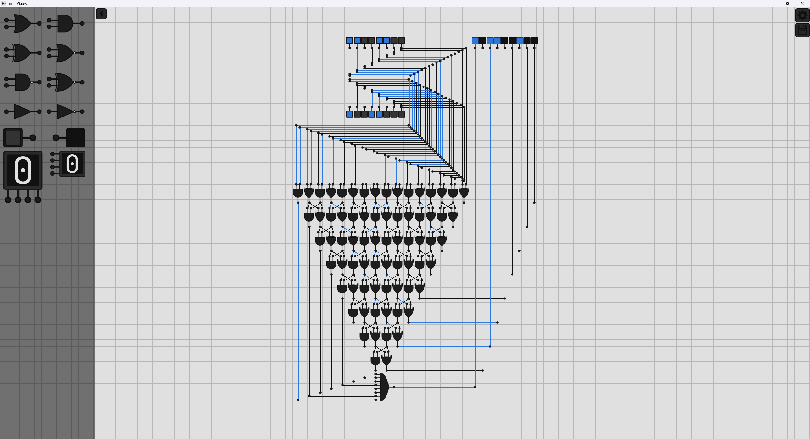
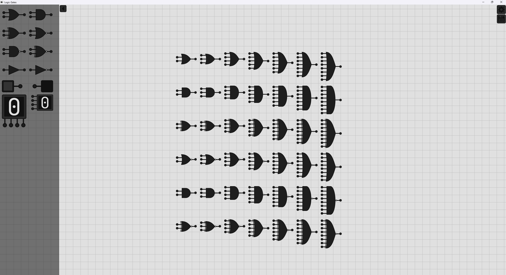
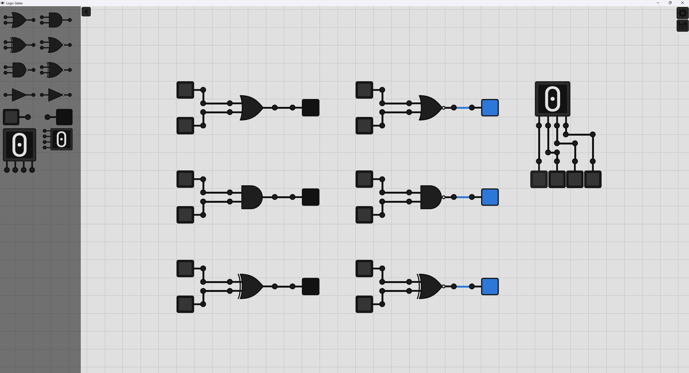
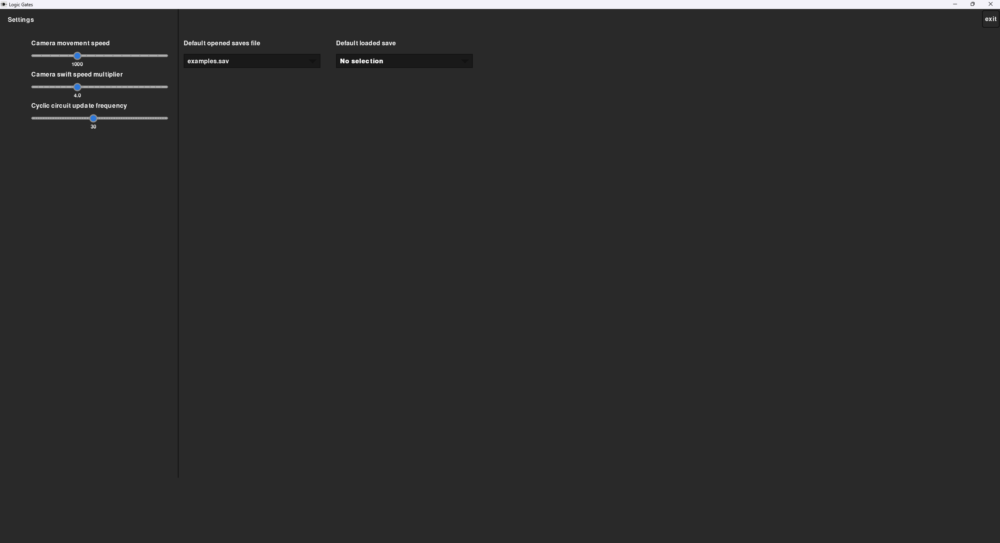
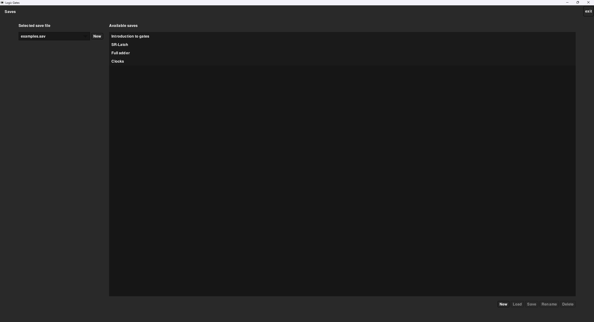

# Logic Gates Editor
A logic gates editor created with Python (3.14.5) utilizing pygame-ce. 

**Supported Gate Types:**
- OR
- AND
- XOR
- NOR
- NAND
- NXOR
- BUFFER
- NOT

**Auxiliary Components:**
- Toggle Switch
- Light
- 4-bit display

**Controls:**
- WASD camera movement
- scroll zooming
- R to rotate selection
- G to disable/enable grid snapping
- N to open prompt for new save
- drag selection
- ctrl+c to copy selection
- ctrl+v to paste selection
- ctrl+z to undo last action
- ctrl+shift+z | ctrl+y to redo
- number keys 2-8 adjust the selected gates' number of inputs

## 8-bit Adder

## Gate Types and Input Variations

## Different Components

## Settings Interface

## Save Interface

